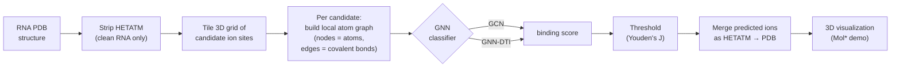

# RNA–Metal Ion GNN

**Predicting Mg²⁺ binding sites in RNA 3D structures with graph neural networks.**

[](https://github.com/deepanshumody/RNA-GNN/actions/workflows/ci.yml)
[](https://www.python.org/)
[](https://pytorch.org/)
[](https://pytorch-geometric.readthedocs.io/)
[](https://gnnrna.streamlit.app/)
[](LICENSE)

Metal ions such as Mg²⁺ are essential cofactors that stabilize RNA tertiary structure and enable catalysis, yet locating their binding sites from structure alone is hard. This project frames the problem as **graph classification**: tile the space around an RNA molecule with candidate ion positions, build a local atomic graph around each candidate, and train a GNN to score how likely that position is to bind a metal ion.

On the bundled 1FUF structure the Graph Convolutional Network reaches **ROC&nbsp;AUC ≈ 0.95**, ranking the single true Mg²⁺ site within the **top ~5%** of ~1,500 candidate positions — a useful candidate-site *filter* under extreme class imbalance. **1FUF is part of the training corpus, so this number is an _in-sample_ sanity check, not a held-out generalisation estimate** (see [Results](#results)). An [interactive demo](https://gnnrna.streamlit.app/) renders its predictions in 3D alongside the experimentally observed ions.

> **▶ Try it live:** **https://gnnrna.streamlit.app/**

<p align="center">
  
  <br>
  <em>The deployed app on the 1FUF ribozyme — experimentally observed ions (left) vs. the GNN's predicted Mg²⁺ binding sites (right, green dots).</em>
</p>

---

## Highlights

- **Two GNN architectures** for the same task — a graph-convolutional baseline (GCN) and a gated graph-attention model adapted from the GNN-DTI drug–target framework ([Lim et al., 2019](https://pubs.acs.org/doi/10.1021/acs.jcim.9b00387)).
- **End-to-end pipeline** from raw PDB structures → candidate-site graphs → trained model → predicted ions merged back into a `.pdb` for visualization.
- **Imbalance-aware evaluation:** with positives at ~0.07% of candidate sites, results are framed as a ranking/filtering task — ROC AUC reported alongside PR-AUC, precision/recall and enrichment, not a single cherry-picked number.
- **Leakage-free splits:** candidate sites are split by *structure* (PDB id), never at random, so near-identical sites from one molecule can't span train/val/test, and whole structures can be held out (`rna_splits.py`). Runs are seeded for reproducibility (`rna_seed.py`).
- **Deployed demo** — a Streamlit + Mol\* app that runs inference on the 1FUF ribozyme and shows predicted vs. real ions side by side.
- **Reproducible dataset construction**, including the scripts used to derive the non-redundant set of RNA structures.

---

## Results

Locating ion sites is an **extreme class-imbalance** problem: on the bundled 1FUF structure only **1 of 1,484** candidate positions is a true Mg²⁺ site (≈ 0.07% positive). The GCN is therefore best read as a **ranker / filter** rather than a hard classifier, and is evaluated with imbalance-aware metrics rather than ROC AUC alone.

> ⚠️ **These numbers are _in-sample_.** 1FUF appears in the non-redundant training list (`data/nonredundantRNA.txt`), so scoring it measures fit, not generalisation. They're shown because the demo ships only this one structure. For an honest estimate, `GNN_models/train_gnn.py` now splits **by structure** and keeps whole PDBs out of training (`HELD_OUT_PDBS`), printing a `HELD-OUT:` line — but reproducing that requires building the full corpus, which isn't bundled here.

<p align="center">
  
</p>

| Metric — GCN on 1FUF (in-sample) | Value | How to read it |
| --- | --- | --- |
| ROC AUC | **0.95** | ranks the true site near the top of all candidates |
| PR-AUC (average precision) | 0.01 | low by construction when positives are ~0.07% |
| Recall @ Youden's-J threshold | 100% (1 / 1) | the true site is recovered |
| Precision @ same threshold | 1.4% (1 / 73) | catching it costs ~72 false positives |
| Enrichment | true site in **top ~5%** | narrows ~1,500 candidates → ~70 for follow-up |

**Why report both?** ROC AUC is optimistic under heavy imbalance, so it's paired with PR-AUC and precision/recall for an honest picture. The practical value is as a first-pass filter that shrinks the candidate search space for downstream analysis. Predictions are binarized at the threshold that maximizes Youden's J (TPR − FPR), which favors recall. These exact numbers are reproduced by `python GNN_models/predfrommodel.py` (which prints `1FUF (in-sample): …`).

> The GNN-DTI variant logs ROC-AUC / PR per epoch during training and is included as an exploratory alternative.

---

## How it works



1. **Graph construction.** Each RNA structure is read with RDKit. A 3D grid of candidate ion positions is laid over the molecule, and for every candidate a subgraph is extracted from the atoms within range — nodes carry chemical atom features. Two adjacencies are stored per candidate: a **covalent** one (`A1`) and a distance-augmented one (`A2`, interatomic distances between receptor and ligand). The grid point nearest a real crystallographic ion is labeled positive.
2. **Models.**
   - **GCN** *(deployed / headline)* — stacked `GCNConv` layers with batch norm and dropout, mean-pooled to a graph embedding and passed through a linear head (raw logit). It consumes the **covalent** adjacency (`A1`); the candidate's position enters through *which* atoms fall inside the cutoff. Trained with a structure-level split and a class-weighted `BCEWithLogitsLoss`. Model in `gcn_model.py`, training in `GNN_models/train_gnn.py`.
   - **GNN-DTI** *(exploratory)* — a gated graph-attention network that **does** use the distance geometry, via a learned Gaussian-over-distance adjacency, adapted from the drug–target interaction model of Lim et al. (2019). Implemented in `GNN_models/GNN-DTI/`.
3. **Inference & visualization.** The trained model scores every candidate site in a new structure; high-scoring positions are merged back into the cleaned PDB as new `HETATM` records so predicted and experimental ions can be compared directly in 3D.

---

## Repository structure

```
RNA-GNN/
├── moleculestreamlit.py          # Streamlit + Mol* demo app (inference + 3D viewer)
├── createpredictedionpdb.py      # Merge predicted coordinates into a PDB as HETATM records
├── best_model.pth                # Trained GCN checkpoint (used by the demo)
│
├── gcn_model.py                  # Shared GCN model (training + inference + demo)
├── rna_splits.py                 # Structure-level (leakage-free) train/val/test split
├── rna_metrics.py                # ROC-AUC + PR-AUC + enrichment (imbalance-aware)
├── rna_seed.py                   # Reproducible seeding
│
├── GNN_models/
│   ├── train_gnn.py              # GCN training — structure-level split, class-weighted, held-out
│   ├── train_gnn1.py             #   variant: loads precomputed graph tensors
│   ├── train_gnn2.py             #   variant: precomputed tensors + negative subsampling
│   ├── predfrommodel.py          # GCN inference on a single RNA structure
│   └── GNN-DTI/                  # Gated graph-attention model (Lim et al. 2019)
│       ├── gnn.py                #   model + (corrected, per-example) FocalLoss
│       ├── layers.py             #   GAT_gate graph-attention layer
│       ├── dataset.py            #   collate_fn + weighted sampler
│       ├── train.py / test.py    #   training / evaluation
│       └── utils.py
│
├── dataset_creation/             # PDB → candidate-site graph pickles (4 labeling strategies)
│   ├── atom_features.py          #   shared atom featuriser (fixes the Mg→H encoding bug)
│   ├── gnn_rna.py                #   3Å grid, nearest point to ion = positive
│   ├── gnn_rna_0A.py             #   grid stops at the molecular surface
│   ├── gnn_rna_autodock.py       #   AutoDock Vina–placed candidate points
│   └── gnn_rna_morepos.py        #   8 grid points around each ion = positive
│
├── preprocessing/                # Build the non-redundant RNA list (exploratory/reference)
│   ├── clustering1.py … clustering3.py
│   └── bestresolutionfromcluster.py
│
├── data/                         # Sample data for the demo (1FUF) + curated lists
│   ├── RNA-only-PDB/ , RNA-only-PDB-clean/ , RNA-graph-pickles/
│   ├── Mg_ions.sdf , nonredundantRNA.txt , OnlyRNAlist.txt
│   └── preds_RNA1FUFf.csv
│
└── assets/roc_curve.png          # ROC curve on the 1FUF demo (AUC ≈ 0.95)
```

---

## Installation

```bash
git clone https://github.com/deepanshumody/RNA-GNN.git
cd RNA-GNN

python3 -m venv venv
source venv/bin/activate        # Windows: venv\Scripts\activate

pip install -r requirements.txt
```

> **Note:** install [PyTorch](https://pytorch.org/) and [PyTorch Geometric](https://pytorch-geometric.readthedocs.io/) with the build that matches your CUDA / CPU setup before (or alongside) the other requirements.
>
> For a known-good, fully pinned set of versions (Python 3.12), use [`requirements-lock.txt`](requirements-lock.txt).

---

## Quickstart — run the demo locally

The demo loads the released checkpoint (`best_model.pth`), runs inference on the bundled 1FUF structure, and shows predicted vs. real ions in an interactive 3D viewer:

```bash
streamlit run moleculestreamlit.py
```

(Or skip setup entirely and open the hosted version: **https://gnnrna.streamlit.app/**.)

---

## Reproducing the pipeline

### 1. Create the dataset

Place RNA-only `.pdb` files in `RNA-only-PDB/`, then run **one** of the dataset-creation scripts depending on the labeling strategy you want:

```bash
python dataset_creation/gnn_rna.py            # 3Å grid (default)
# or gnn_rna_0A.py / gnn_rna_autodock.py / gnn_rna_morepos.py
```

Each writes per-structure graph pickles (`<pdb>_pos.pkl`, `<pdb>_neg.pkl`). Dataset variants:

| Variant            | Candidate placement                          | ~Positives | ~Negatives |
| ------------------ | -------------------------------------------- | ---------- | ---------- |
| `gnn_rna`          | 3Å grid; nearest point to ion = positive     | ~3,000     | ~1,000,000 |
| `gnn_rna_0A`       | grid stops at the molecular surface          | ~2,500     | ~500,000   |
| `gnn_rna_autodock` | AutoDock Vina–placed candidate points        | —          | —          |
| `gnn_rna_morepos`  | 8 grid points around each ion = positive     | ~12,000    | ~1,000,000 |

> A Mg²⁺ ideal-geometry SDF (e.g. `data/Mg_ions.sdf`) is used as the ligand template when building graphs.

### 2. Train

```bash
# GCN
python GNN_models/train_gnn.py

# GNN-DTI (set the GPU index)
CUDA_VISIBLE_DEVICES=0 python GNN_models/GNN-DTI/train.py
```

The best GCN checkpoint is saved to `best_model.pth`. Training splits **by structure** (PDB id) via `rna_splits.py`, holds the structures in `HELD_OUT_PDBS` out of the corpus entirely, weights the loss by the class ratio, and is seeded (`rna_seed.py`). Each run prints `train` / `valid` / `test` and a `HELD-OUT:` line with ROC-AUC, PR-AUC and enrichment (`rna_metrics.py`). Update the data-directory constants near the top of each script to point at your generated pickles.

### 3. Predict / evaluate

```bash
# GCN — single structure
python GNN_models/predfrommodel.py

# GNN-DTI
CUDA_VISIBLE_DEVICES=0 python GNN_models/GNN-DTI/test.py
```

### (Optional) Rebuild the non-redundant RNA list

The `preprocessing/` scripts (`clustering1.py` → `clustering3.py` → `bestresolutionfromcluster.py`) reproduce `nonredundantRNA.txt` — RNAs deduplicated by sequence similarity, keeping the best resolution (< 6 Å) per cluster — starting from `data/OnlyRNAlist.txt`. These are exploratory/reference scripts and may need light adaptation to your environment; the resulting list is already provided.

---

## Notes & limitations

- The headline metrics are **in-sample**: 1FUF is in the training list, so they measure fit on a seen structure, not generalisation. A held-out number needs the full corpus (not bundled) and the structure-level split the training scripts now use. Given the extreme class imbalance (positives ≈ 0.07% of candidate sites), the model is a candidate-site **ranker / filter**, not a precise point locator.
- The deployed GCN scores the **covalent** graph; it does not see interatomic distances (those are stored in `A2` and used by the GNN-DTI variant). So the candidate's position enters only through which atoms are in range — a deliberately simple representation.
- Results are reported for the GCN; the GNN-DTI variant is an exploratory alternative and its metrics are logged per epoch during training rather than as a single headline number.
- The demo ships with one structure (1FUF) for a fast, self-contained showcase; the full training corpus is built from the non-redundant RNA list.
- Several `dataset_creation/` and `preprocessing/` scripts began life as research notebooks; they are included for transparency and reproducibility of the data pipeline.

---

## References

- Lim, J. et al. *Predicting Drug–Target Interaction Using a Novel Graph Neural Network with 3D Structure-Embedded Graph Representation.* **J. Chem. Inf. Model.** 2019. [DOI: 10.1021/acs.jcim.9b00387](https://pubs.acs.org/doi/10.1021/acs.jcim.9b00387) — basis for the GNN-DTI architecture.

### Slides

- [Slide Deck 1](https://purdue0-my.sharepoint.com/:p:/g/personal/modyd_purdue_edu/EXJN6pxMfNZBnivvTjUdbCABFum4tNid0VJ6X5CW7WLyXA?e=6eIJPs)
- [Slide Deck 2](https://purdue0-my.sharepoint.com/:p:/g/personal/modyd_purdue_edu/EdZh7vnDzwZClZ6i372E_DUB3SrtWZm17wQpZd03VlAa8w?e=kDzZlA)

---

## Development

```bash
pip install -r requirements-dev.txt
ruff check .      # lint (critical-error rules)
pytest -q         # tests
```

[GitHub Actions CI](.github/workflows/ci.yml) runs linting, byte-compilation, and the test suite on every push and pull request. Tests cover the structure-level split (no PDB leaks across folds), the imbalance-aware metrics, the atom featuriser's Mg fix, the PDB-merge formatting, and forward-pass / checkpoint-loading smoke tests for both models (the heavier ones skip automatically where the deep-learning stack isn't installed).

---

## License

Released under the [MIT License](LICENSE).

## Contact

**Deepanshu Mody** · [GitHub](https://github.com/deepanshumody)
Questions and contributions welcome — open an issue or reach out directly.
